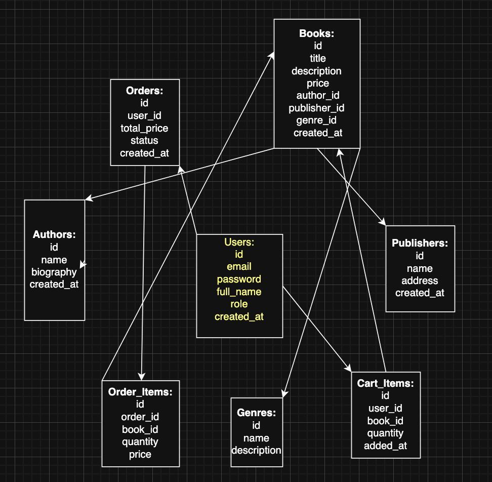

# Online Bookstore 📚

## Description

The Online Bookstore is a web application where users can browse the book catalog, filter by genres, authors, or publishers, read descriptions, add books to the cart, and place orders. Users can also register, create their own profile, and view their order history. Administrators can add new books, edit information, and manage orders.

---

### 🔑 Authentication

#### `POST /auth/register`

* **Usage**: Register a new user
* **Method**: POST
* **Response status**: `201 Created`

#### `POST /auth/login`

* **Usage**: Log in (receive JWT token)
* **Method**: POST
* **Response status**: `200 OK`

#### `GET /auth/me`

* **Usage**: Get current user information
* **Method**: GET
* **Response status**: `200 OK`

---

### 👤 Users

#### `GET /users/{id}`

* **Usage**: Get public information about a user
* **Method**: GET
* **Response status**: `200 OK`

#### `PUT /users/me`

* **Usage**: Update profile information
* **Method**: PUT
* **Response status**: `200 OK`

---

### 📚 Books

#### `GET /books`

* **Usage**: Get a list of books with search and filter options
* **Method**: GET
* **Response status**: `200 OK`

#### `POST /books` (admin)

* **Usage**: Add a new book
* **Method**: POST
* **Response status**: `201 Created`

#### `GET /books/{id}`

* **Usage**: Get detailed information about a book
* **Method**: GET
* **Response status**: `200 OK`

#### `PUT /books/{id}` (admin)

* **Usage**: Update book information
* **Method**: PUT
* **Response status**: `200 OK`

#### `DELETE /books/{id}` (admin)

* **Usage**: Delete a book
* **Method**: DELETE
* **Response status**: `204 No Content`

---

### ✍️ Authors

#### `GET /authors`

* **Usage**: Get a list of authors
* **Method**: GET
* **Response status**: `200 OK`

#### `POST /authors` (admin)

* **Usage**: Add a new author
* **Method**: POST
* **Response status**: `201 Created`

#### `GET /authors/{id}`

* **Usage**: Get information about an author and their books
* **Method**: GET
* **Response status**: `200 OK`

---

### 🏢 Publishers

#### `GET /publishers`

* **Usage**: Get a list of publishers
* **Method**: GET
* **Response status**: `200 OK`

#### `GET /publishers/{id}`

* **Usage**: Get information about a publisher and their books
* **Method**: GET
* **Response status**: `200 OK`

---

### 🎭 Genres

#### `GET /genres`

* **Usage**: Get a list of genres
* **Method**: GET
* **Response status**: `200 OK`

#### `GET /genres/{id}`

* **Usage**: Get books of a specific genre
* **Method**: GET
* **Response status**: `200 OK`

---

### 🛒 Cart

#### `GET /cart`

* **Usage**: View the user's cart
* **Method**: GET
* **Response status**: `200 OK`

#### `POST /cart/items`

* **Usage**: Add or update a book in the cart
* **Method**: POST
* **Response status**: `200 OK`

#### `DELETE /cart/items/{book_id}`

* **Usage**: Remove a book from the cart
* **Method**: DELETE
* **Response status**: `204 No Content`

---

### 📦 Orders

#### `POST /orders/checkout`

* **Usage**: Create an order from the cart
* **Method**: POST
* **Response status**: `201 Created`

#### `GET /orders`

* **Usage**: View order history
* **Method**: GET
* **Response status**: `200 OK`

#### `GET /orders/{id}`

* **Usage**: View order details
* **Method**: GET
* **Response status**: `200 OK`

---

### ℹ️ Info

#### `GET /info/about`

* **Usage**: “About Us” page
* **Method**: GET
* **Response status**: `200 OK`

---

## Database Schema

